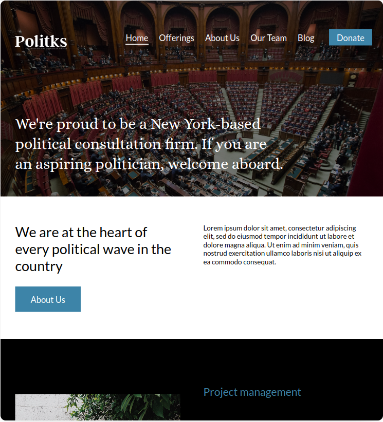

# Politks:  Simplifying Politics, Empowering Citizens
Politks will be a modern and intuitive platform aimed at making it easier to access relevant information about the
political landscape, covering candidates, parties, political histories, and the progress of legislative proposals. Its
focus will be on transparency and ease of use, enabling citizens to have more control over what happens in the political
environment in a simplified and accessible way.

[swot-pestel](https://venturusai.com/business/20oPTP-politks)

[apresentacao](https://gamma.app/docs/Politks-Plataforma-para-Simplificacao-de-Informacoes-Politicas-8etlxcftefa7m1p)

### Rascunho de ideias

O Politks será uma plataforma, que tem como principal objetivo simplificar a maneira de se obter informações sobre
politica.

Através dele será possível:

- Consultar candidatos de todas as eleições (E quem/quais ganharam)
- Traçar histórico político de (nome_generico_para_todos_cargos_politos)
- [histórico_politico] (partidos, processos, propostas, ações_políticas, eleições com cargos, causas de apoio, causas de
  repudio)
- Consultar partidos politicos
- Consultar atuais candidatos de cada partido
- Consultar status da câmara e listar informações sobre quais candidatos votaram afavor ou contra determinada proposta

# Politks: Plataforma para Simplificação de Informações Políticas

O Politks será uma plataforma moderna e intuitiva, com o objetivo de facilitar o acesso a informações relevantes sobre o
cenário político, abrangendo candidatos, partidos, históricos políticos e o andamento de propostas legislativas. Seu
foco será a transparência e a facilidade de uso, permitindo que cidadãos tenham mais controle sobre o que acontece no
ambiente político de forma simplificada e acessível.

### Funcionalidades Principais

1. Consulta de Candidatos (de Todas as Eleições)
   Permitir ao usuário pesquisar candidatos de todas as eleições passadas e futuras.
   Exibir informações detalhadas dos candidatos, incluindo:
   Nome completo
   Cargo ao qual concorreu/ocupa
   Resultado da eleição (vencedor ou não)
   Afiliados partidários
   Propostas e promessas de campanha
2. Histórico Político dos Candidatos
   A plataforma fornecerá um histórico completo dos candidatos, cobrindo:
   Cargos já ocupados (prefeito, governador, deputado, etc.)
   Filiação partidária ao longo do tempo
   Processos legais, investigações ou envolvimentos em escândalos
   Propostas e ações políticas
   Projetos de lei ou medidas defendidas
   Causas apoiadas ou rejeitadas
   Votação e envolvimento em eleições
3. Consulta de Partidos Políticos
   Exibir a lista de todos os partidos ativos, junto com informações relevantes:
   Nome do partido
   Sigla e número
   Data de fundação
   Ideologia e princípios defendidos
   Histórico de candidatos eleitos
   Propostas centrais do partido
   Membros proeminentes ao longo do tempo
4. Consulta de Candidatos Atuais
   Listar os candidatos atuais de cada partido para todas as eleições em andamento.
   Permitir a filtragem por localidade (cidade, estado, país) e por cargo.
   Mostrar informações como:
   Afiliados partidários
   Propostas e promessas
5. Acompanhamento de Propostas Legislativas
   Exibir informações sobre propostas legislativas em discussão na Câmara e no Senado.
   Permitir ao usuário visualizar como cada político votou em relação a determinadas propostas.
   Mostrar status da votação (aprovada, rejeitada, em andamento).
   Exibir análises sobre como determinadas votações impactam o cenário político e econômico.
6. Perfis Detalhados dos Políticos
   Cada político terá um perfil completo com suas informações pessoais e políticas, incluindo:
   Histórico de cargos ocupados
   Votações em que participou
   Posicionamento em causas importantes
   Propostas apresentadas
   Investigação de possíveis irregularidades ou processos em andamento
   Redes sociais e interação pública
   Essa estrutura proporciona uma visão ampla sobre o cenário político, oferecendo uma plataforma poderosa e abrangente.
   É interessante também considerar uma interface gráfica moderna e uma boa usabilidade para manter a experiência
   agradável para os usuários.

### Monetização

monetização através de assinatura premium, oferecendo alertas personalizados sobre votações
importantes, acesso a históricos mais detalhados ou análise política mais profunda para jornalistas e pesquisadores.